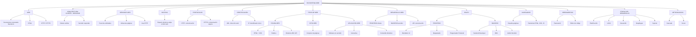

```mermaid
graph TD
  A[ECOSISTEMA WEB] --> B[WEB]
  A --> C[ARQUITECTURA CLIENTE - SERVIDOR]
  A --> D[SERVIDOR WEB]
  A --> E[HOSTING]
  A --> F[PROTOCOLOS]
  A --> G[IDENTIFICACIÓN]
  A --> H[TIPOS DE WEB]
  A --> I[DESARROLLO WEB]
  A --> J[ROLES]
  A --> K[NAVEGADOR]
  A --> L[HERRAMIENTAS]
  A --> M[ETAPAS DEL DESARROLLO]
  A --> N[METODOLOGÍAS]

  B --> B1[Documentos conectados<br/>hipertexto]
  B --> B2[HTML]
  B --> B3[HTTP / HTTPS]

  C --> C1[Cliente solicita]
  C --> C2[Servidor responde]

  D --> D1[Escucha solicitudes]
  D --> D2[Almacena páginas]
  D --> D3[Usa HTTP]

  E --> E1[Espacio donde se aloja<br/>el sitio web]

  F --> F1[HTTP: comunicación]
  F --> F2[HTTPS: comunicación<br/>segura]

  G --> G1[URL: dirección web]
  G --> G2[IP: identificador único]

  H --> H1[PÁGINA WEB]
  H --> H2[SITIO WEB]
  H --> H3[APLICACIÓN WEB]

  H1 --> H1A[HTML + CSS]
  H1 --> H1B[Estática]
  H1 --> H1C[Dinámica BD / API]

  H2 --> H2A[Conjunto de páginas]

  H3 --> H3A[Software en servidor]
  H3 --> H3B[Interactiva]
  H3 --> H3C[Contenido dinámico]

  I --> I1[FRONTEND cliente]
  I --> I2[BACKEND servidor]
  I --> I3[API comunicación]

  J --> J1[FRONTEND]
  J --> J2[BACKEND]

  J1 --> J1A[Diseñador UI]
  J1 --> J1B[Maquetador]
  J1 --> J1C[Programador Frontend]

  J2 --> J2A[Backend Developer]
  J2 --> J2B[DBA]
  J2 --> J2C[Admin Servidor]

  K --> K1[Visualiza páginas]
  K --> K2[Renderiza HTML, CSS, JS]

  L --> L1[Framework]
  L --> L2[Editor de código]

  M --> M1[Planificación]


  M --> M2[UX/UI]
  M --> M3[Desarrollo]
  M --> M4[Despliegue]
  M --> M5[Soporte]

  N --> N1[Cascada]
  N --> N2[Scrum]
```
